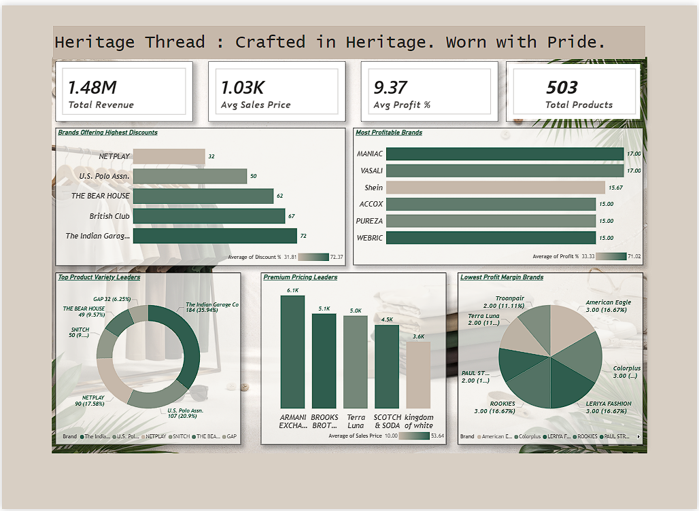
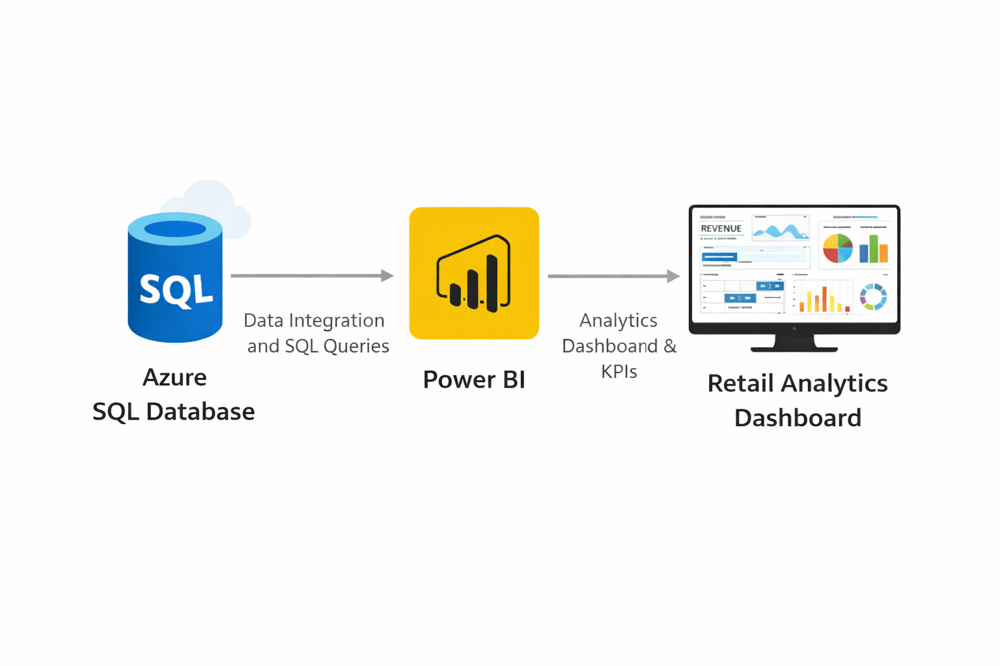

# Retail Analytics using Azure SQL & Power BI



## Live Dashboard  
🔗 **View Report:**  
https://app.powerbi.com/view?r=eyJrIjoiM2IyYzhlMGYtYjNiOC00MmMyLTgzMmYtZDAyMDNhNTVkMzMzIiwidCI6ImNlOTAwODg5LTY5NTctNDJlMy04NWNlLTQwNTQyMzZiNjNiZCJ9

---

## Project Overview

This project is an end-to-end **Retail Analytics Solution** built using **Azure SQL Database** and **Power BI**.

The dataset was uploaded to Azure SQL Database, cleaned using SQL queries, connected with Power BI, and transformed into an interactive dashboard to analyze:

- Revenue Performance  
- Profitability Trends  
- Discount Strategies  
- Brand Comparison  
- Product Distribution  

This project demonstrates practical cloud analytics implementation with Microsoft technologies.

---

## Architecture



Retail Dataset  
➡ Azure SQL Database  
➡ SQL Data Cleaning  
➡ Power BI Data Modeling  
➡ Dashboard Development  
➡ Power BI Service Deployment

---

## Tech Stack

| Category | Tools Used |
|---------|------------|
| Cloud Platform | Microsoft Azure |
| Database | Azure SQL Database |
| Query Language | SQL |
| Visualization | Power BI |
| Modeling | DAX |
| Deployment | Power BI Service |

---

## SQL Data Cleaning Example

Used SQL queries to clean pricing columns:

```sql
UPDATE [dbo].[Mens Tshirt]
SET original_price = TRIM(REPLACE(CAST(original_price AS VARCHAR(MAX)), '?', ''))
WHERE original_price LIKE '%?%';

UPDATE [dbo].[Mens Tshirt]
SET sale_price = TRIM(REPLACE(CAST(sale_price AS VARCHAR(MAX)), '?', ''))
WHERE sale_price LIKE '%?%';
